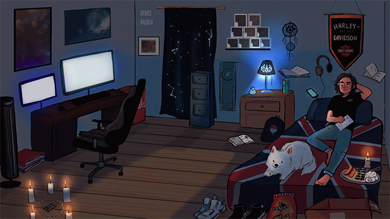

## Hello World! ☕



```javascript
object luca {
 name : "Luca Destefano Boer",
 age : 20,
 acknowledgements : "Fullstack",
 code : ["Javascript", "HTML", "CSS", "Typescript"],
 tools : [
 "React", "React Native", "Next.js", "Redux", "TypeScript",
 "Git", "Styled-components", "Stitches", "Tailwind", "Jest", 
 "Node.js", "Prisma", "Fastify", "Docker", "PostgreSQL"
 ],
 skillset : ["Ambição", "Foco", "Disciplina" e "Proatividade"],
```
<br>

<div>
  <a href="https://github.com/lucadboer">
  
 
</div>
  
<div style="display: inline_block"><br>
  
  
  
  
  
  
  
  
  
                                                                     </div> 
  
  ##
  
<div>
  <a href="https://about-luca.vercel.app/" target="_blank"></a>
  <a href="https://instagram.com/luca_steffano" target="_blank"></a>
  <a href="https://www.linkedin.com/in/luca-destefano-boer-99674121b/" target="_blank"></a>
</div>
  
